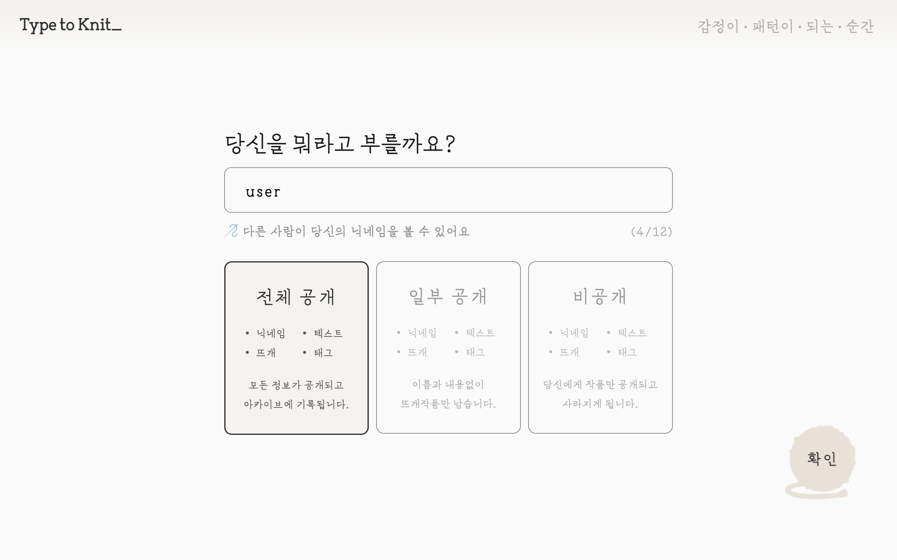
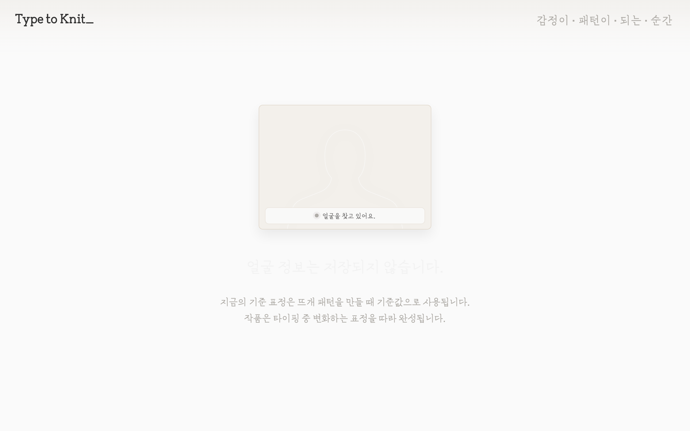
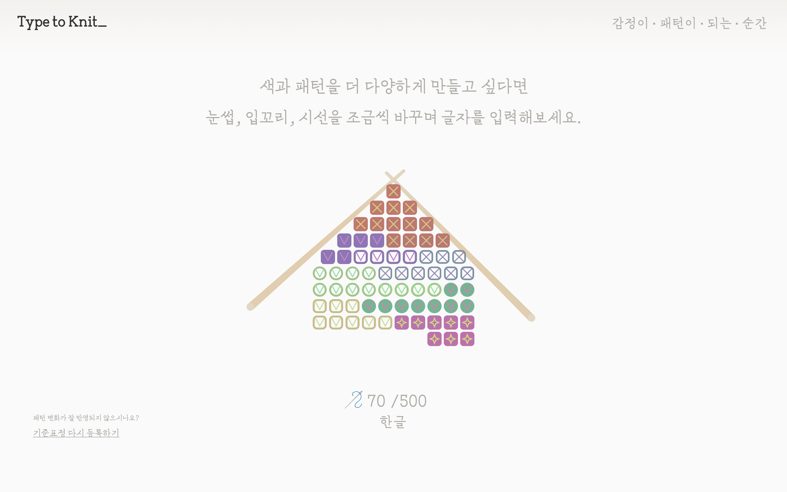
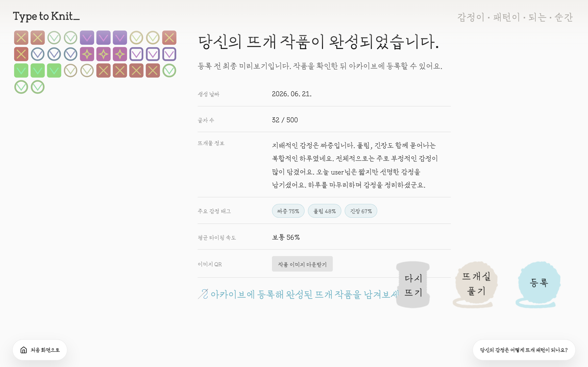
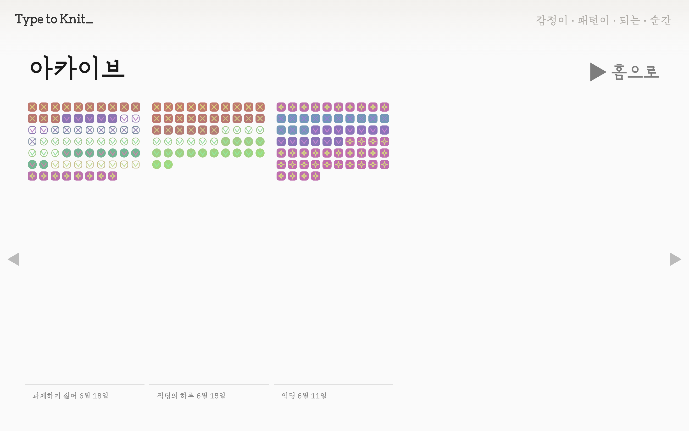
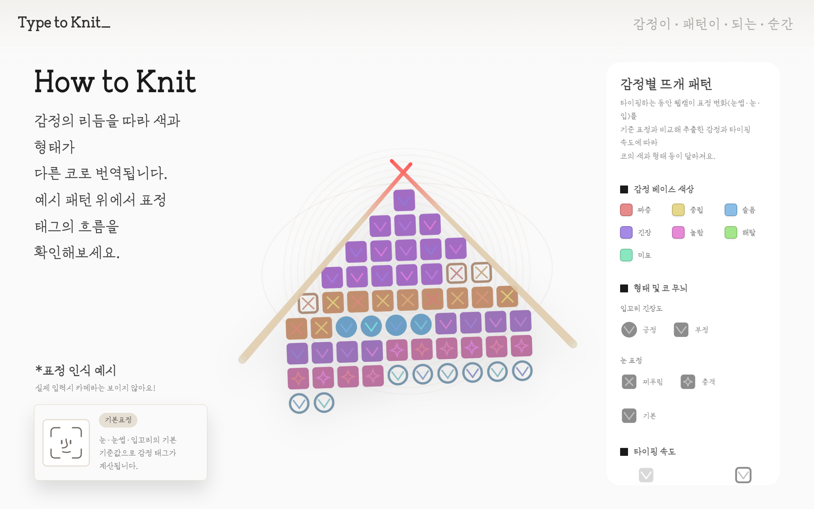

# Type to Knit_

감정이 패턴이 되는 순간.

Type to Knit_은 키보드 입력과 얼굴 표정을 감정 신호로 읽어, 실시간 뜨개 패턴으로 시각화하는 인터랙티브 웹 아트 프로젝트입니다. 감정이 격해질 때 우리는 본능적으로 타이핑합니다. 그 흔적을 남기고 싶지 않을 때, Type to Knit_은 글자 대신 뜨개 패턴을 남깁니다.

## Concept

감정이 격해질 때 우리는 본능적으로 타이핑합니다.
그 흔적을 남기고 싶지 않을 때, Type to Knit_은 글자 대신 뜨개 패턴을 남깁니다.

이 프로젝트는 타이핑이라는 일상적 행위를 뜨개질로 전환하고, 글자 내용이 아닌 입력 방식과 감정, 표정의 변화를 시각화합니다. 완성된 결과물은 아카이브에 저장되어 하나의 감정 기록이 됩니다.

## 핵심 방향

- 타이핑이라는 일상적 행위를 뜨개질로 전환
- 글자 내용보다 입력 방식, 감정, 표정 변화를 시각화
- 결과물을 아카이브에 저장해 감정의 기록으로 남김
- 사용자가 작품을 저장하거나 풀어버릴 수 있게 설계

## Workflow

Type to Knit_의 패턴은 입력, 처리, 출력의 세 단계로 생성됩니다.

| 단계 | 데이터 | 처리 방식 | 시각 출력 |
| --- | --- | --- | --- |
| 입력 | 웹캠 표정 | 눈, 눈썹, 입 변화량 측정 | 감정 태그, 텐션, 눈 모양으로 변환 |
| 입력 | 키보드 타이핑 | 1초 단위 타이핑 속도 측정 | 채도, 명도, 채움 정도로 변환 |
| 처리 | 감정 태그 | 짜증, 중립, 해탈 등 7종 분류 | 코 배경색 hue |
| 처리 | 텐션 | 입 크기 점수 0~1 | 코 외곽 모양, 원형 또는 사각형 |
| 처리 | 눈 모양 | frown, surprised 등 | 코 안쪽 무늬, X, 별, V |
| 출력 | 글자 | 글자당 코 하나 | 뜨개 패턴 |

## User Flow

1. 닉네임을 입력하고 공개 범위를 선택합니다.
2. 카메라 화면에서 기준 표정을 등록합니다.
3. 감정 문장을 타이핑하면 실시간으로 코가 생성됩니다.
4. 완성된 뜨개 작품의 미리보기와 감정 정보를 확인합니다.
5. 작품을 아카이브에 등록하거나, 다시 뜨거나, 풀어버릴 수 있습니다.
6. 등록된 작품은 아카이브에서 목록과 상세 화면으로 다시 볼 수 있습니다.

공개 범위는 전체 공개, 일부 공개, 비공개로 나뉩니다. 일부 공개는 닉네임과 텍스트를 숨기고 작품 중심으로 저장하며, 비공개 작품은 아카이브에 저장하지 않습니다.

## 예시 화면

### 온보딩

| 닉네임 입력 | 기준 표정 등록 |
| --- | --- |
|  |  |

### 타이핑과 미리보기

| 타이핑 | 완성 미리보기 |
| --- | --- |
|  |  |

### 아카이브와 작품 상세보기

| 아카이브 | 작품 상세보기 |
| --- | --- |
|  |  |

### How to Knit 가이드



## 주요 기능

### 실시간 뜨개 렌더링

- p5.js와 Canvas 2D로 코를 매 프레임 실시간 드로잉합니다.
- 글자 입력마다 실이 생성되어 짜여 들어오는 애니메이션을 제공합니다.
- 아카이브와 미리보기에서는 p5 없이 브라우저 기본 Canvas API로 작품을 다시 그립니다.
- pixelDensity를 적용해 고해상도 작품 이미지를 생성합니다.

### FaceMesh 기반 표정 추적

- ml5.js FaceMesh로 웹캠에서 얼굴 랜드마크를 추출합니다.
- 시작 시 무표정을 기준값으로 등록합니다.
- 표정이 기준에서 벗어난 변화량을 1초 간격으로 측정합니다.
- 눈썹, 눈, 입 세 부위를 점수화하고, 그 조합을 7개 감정으로 분류합니다.
- 카메라는 기준 표정 등록 단계에서만 사용자에게 노출되며, 실제 타이핑 중에는 보이지 않습니다.

### 감정 패턴 변환

| 감정 | 패턴 색상 방향 |
| --- | --- |
| 짜증 | 빨강 |
| 중립 | 노랑 |
| 해탈 | 초록 |
| 미묘함 | 청록 |
| 슬픔 | 파랑 |
| 긴장 | 보라 |
| 놀람 | 마젠타 |

패턴은 단순 색상만이 아니라 코의 외곽 형태, 내부 무늬, 채도, 명도, 채움 정도까지 함께 바뀝니다. 빠르게 타이핑할수록 색과 채움이 진해지고, 백스페이스는 끊어진 실처럼 표현됩니다.

### 아카이브 저장

- 완성된 작품은 Dexie.js 기반 IndexedDB에 저장됩니다.
- 서버 없이 브라우저 로컬 DB에 저장되므로 새로고침이나 재방문 후에도 유지됩니다.
- 네트워크 의존 없이 단독 구동이 가능합니다.
- 기본 예시 작품을 자동으로 등록해 첫 방문에서도 아카이브 화면을 확인할 수 있습니다.

### QR 이미지 저장

- 완성 작품 이미지를 생성하고 ImgBB에 업로드합니다.
- 업로드된 이미지 URL을 QRCode.js로 QR 코드화합니다.
- 사용자는 휴대폰으로 QR을 스캔해 작품 이미지를 저장할 수 있습니다.
- 이 기능은 `config.js`의 ImgBB API 키가 있어야 동작합니다.

## Play Test 반영

발표자료 기준으로 다음 피드백을 반영했습니다.

### 1. 온보딩 콘셉트 설명 강화

문제:
작품의 메시지와 핵심 작동 원리가 체험 전에 충분히 전달되지 않았습니다.

개선:
콘셉트, 서비스 흐름, 예시 타이핑 화면을 제공해 사용자가 작동 방식을 먼저 이해할 수 있게 했습니다.

### 2. 표정 등록 단계 개선

문제:
"편안한 표정" 안내가 헷갈려 사용자가 제각각의 표정을 등록했고, 카메라가 계속 떠 있어 방해가 되었습니다.

개선:
안내를 "무표정"으로 통일하고, 카메라는 등록 단계에서만 노출되도록 정리했습니다. 측정 정확도와 콘셉트 일관성을 함께 유지하는 방향입니다.

### 3. 작품 저장 및 아카이브 삭제

문제:
사용자가 작품을 개인적으로 보관하고 싶거나, 아카이브 등록 후 공개 여부를 바꾸고 싶어 했습니다.

개선:
QR 코드를 통한 작품 저장 흐름을 추가하고, 아카이브에서 작품을 직접 삭제할 수 있는 풀기 인터랙션을 마련했습니다.

### 4. 작동 원리 가시화

문제:
어떤 감정과 표정이 어떤 패턴으로 이어지는지 이해하기 어려웠습니다.

개선:
미리보기 화면에서 감정 정보를 직접 확인할 수 있게 하고, How to Knit 가이드를 통해 왜 이런 패턴이 나왔는지 읽을 수 있게 했습니다.

## 기술 구성

- HTML, CSS, JavaScript
- p5.js: 실시간 캔버스 렌더링
- Canvas 2D API: 아카이브 및 이미지 렌더링
- ml5.js FaceMesh: 얼굴 랜드마크 감지
- Dexie.js / IndexedDB: 브라우저 로컬 아카이브
- QRCode.js: QR 코드 생성
- ImgBB API: 작품 이미지 업로드

## 주요 파일 구조

```text
.
├── index.html                  # 전체 화면 구조와 스크립트 로딩
├── style.css                   # 화면 스타일
├── indexDesign.js              # 화면 전환, 완성 화면, QR 생성 등 UI 로직
├── knitSketch.js               # p5.js 메인 스케치와 캔버스 제어
├── KnitstampInputController.js # 얼굴 변화와 타이핑 속도 기록
├── KnitCell.js                 # 실시간 뜨개 코의 시각 스타일
├── KnitPiece.js                # 아카이브 저장용 뜨개 데이터 변환
├── page_S4.js                  # 실시간 뜨개 패턴 생성 엔진
├── page_S5.js                  # IndexedDB 아카이브 저장 로직
├── page_S7_S8.js               # 아카이브 목록과 상세 뷰
├── S10.js                      # How to Knit 미리보기 화면
├── S19.js                      # 입장 소개 화면
├── defaultArchivePieces.js     # 기본 아카이브 예시 데이터
├── config.example.js           # ImgBB API 키 설정 예시
├── config.js                   # 로컬 실행용 실제 설정 파일
├── libraries/                  # 로컬 p5 라이브러리
└── images/                     # UI 이미지와 그래픽 에셋
```

## 실행 방법

정적 웹 프로젝트이므로 로컬 서버에서 실행할 수 있습니다. 카메라 권한과 외부 라이브러리 로딩을 안정적으로 사용하려면 파일을 직접 여는 것보다 로컬 서버 실행을 권장합니다.

```bash
python3 -m http.server 8000
```

브라우저에서 아래 주소로 접속합니다.

```text
http://localhost:8000
```

## 설정 방법

QR 이미지 업로드 기능을 사용하려면 `config.example.js`를 참고해 `config.js`를 준비합니다.

```js
var CONFIG = {
  IMGBB_API_KEY: 'YOUR_IMGBB_API_KEY'
};
```

ImgBB API 키가 없어도 감정 입력, 뜨개 패턴 생성, 로컬 아카이브 체험은 가능합니다. 다만 완성 이미지를 QR로 저장하는 기능은 동작하지 않을 수 있습니다.

## 데이터와 개인정보

- 카메라는 기준 표정 등록과 표정 변화 감지를 위해 사용됩니다.
- 얼굴 이미지는 아카이브에 저장하지 않습니다.
- 패턴에는 얼굴 랜드마크 변화값, 감정 태그, 타이핑 속도 등이 반영됩니다.
- 공개 작품은 닉네임, 패턴 데이터, 태그, 작품 정보가 브라우저 IndexedDB에 저장됩니다.
- 일부 공개 작품은 닉네임과 텍스트 정보를 숨기고 뜨개 작품 중심으로 저장됩니다.
- 비공개 작품은 아카이브에 저장하지 않습니다.
- QR 이미지 공유를 사용할 경우 완성 이미지가 ImgBB API로 업로드됩니다.

## GitHub

- Repository: https://github.com/xxykens/ICTI_Type2Knit.git
- Page: https://xxykens.github.io/ICTI_Type2Knit/

## Team

| 이름 | 역할 |
| --- | --- |
| 전수정 | 팀장, 기획 |
| 권예빈 | 패턴 엔진 |
| 최유리 | 아카이브, 데이터 |
| 최윤희 | 온보딩, UI |
| 홍세위 | 페이스 트래킹 |

## 한 줄 소개

Type to Knit_은 남기기 어려운 감정의 문장을, 타이핑 리듬과 표정 변화로 뜨개질해 글 대신 패턴으로 저장하는 인터랙티브 웹 작품입니다.
